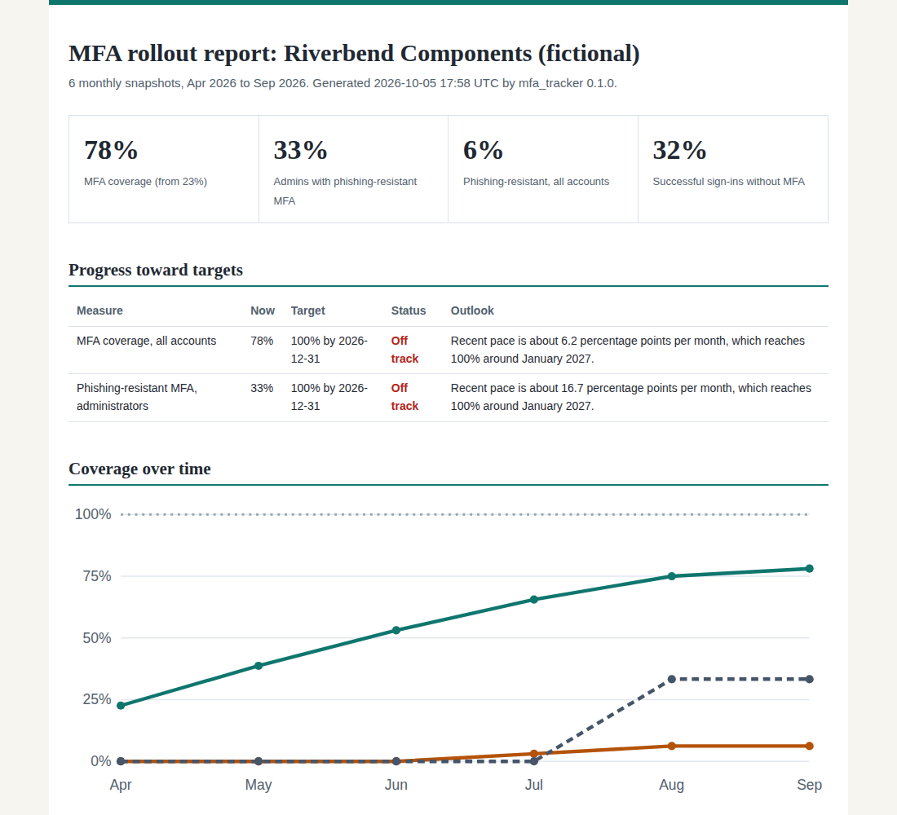

# MFA Compliance Tracker

[](https://github.com/Edward-Owusu/mfa-compliance-tracker/actions/workflows/tests.yml)
[](LICENSE)
[](https://doi.org/10.5281/zenodo.23171910)
[](https://mfa-compliance-tracker.streamlit.app)

An open-source tool that tracks an organization's **multi-factor authentication rollout over time**. It shows whether MFA coverage is on pace to meet its target, which departments and people are falling behind, whether anyone's MFA has been removed or weakened, and **where sign-ins still bypass MFA** through legacy protocols and policy gaps.

It is built for small and mid-sized organizations, such as manufacturers, warehouses, and suppliers in critical U.S. supply chains, that are rolling out MFA without a dedicated identity team or monitoring platform.



## Why this matters

MFA is one of the most effective protections against account takeover, and federal guidance has made it a baseline expectation: NIST SP 800-53 requires it for privileged and non-privileged accounts, OMB Memorandum M-22-09 set phishing-resistant MFA as a federal Zero Trust goal, and CISA's Cross-Sector Cybersecurity Performance Goals include phishing-resistant MFA as a baseline practice.

Turning MFA on is rarely the hard part. Finishing the rollout is. Coverage stalls with a few departments and shift workers, administrators stay on phishable methods, help desk resets quietly remove MFA, and old email protocols keep accepting passwords alone. A one-time audit misses all of this. Organizations need to see the trend.

This tool turns monthly MFA registration exports into a progress report: coverage over time, a projection against the target date, laggards by department and by person, regressions, and the sign-in paths that bypass MFA entirely.

## What it does

- Tracks **MFA coverage** and **phishing-resistant coverage** across monthly snapshots, for all accounts and for administrators.
- **Projects** whether each target will be met by its deadline, based on the recent enrollment pace.
- Compares **departments** and shows how much each has improved since the first snapshot.
- Identifies **persistent non-enrollers**, users still without MFA after several monthly checks.
- Detects **MFA regressions**: methods removed or weakened since the previous snapshot.
- Finds **MFA bypass** in sign-in data: successful sign-ins through legacy protocols such as IMAP, POP3, and basic-auth SMTP, and single-factor sign-ins through modern clients.
- Flags failed legacy-protocol sign-ins, a common sign of password spraying.
- Maps findings to **NIST SP 800-53 Rev. 5** controls (IA-2, IA-2(1), IA-2(2), IA-5, CM-7, PM-6).
- Produces reports in **HTML** (with a built-in trend chart), **Markdown, CSV, and JSON**, with a command-line tool and an interactive **Streamlit dashboard** where targets can be adjusted.
- Has **no third-party dependencies** in its core engine.

## Quick start

Requires Python 3.10 or later.

```bash
git clone https://github.com/Edward-Owusu/mfa-compliance-tracker.git
cd mfa-compliance-tracker
pip install -e .

mfa-tracker samples/riverbend_mfa_snapshots.csv --signins samples/riverbend_signins.csv --org "Riverbend Components"
```

Example output:

```
Riverbend Components | 6 snapshots, 2026-04-30 to 2026-09-30
MFA coverage: 78% (from 23%) | Phishing-resistant: 6%
Successful sign-ins without MFA: 32%
  MFA coverage, all accounts: Off track. Recent pace is about 6.2 percentage points per month, which reaches 100% around January 2027.
  Phishing-resistant MFA, administrators: Off track. Recent pace is about 16.7 percentage points per month, which reaches 100% around January 2027.
  [HIGH    ] MFA-02 User without MFA (1 account)
  [HIGH    ] MFA-03 User still not enrolled after several monthly checks (6 accounts)
  [HIGH    ] MFA-04 MFA removed or weakened since the previous snapshot (1 account)
  [HIGH    ] MFA-07 Successful sign-ins through legacy protocols that bypass MFA
  ...
```

Open the HTML file in the `reports` folder for the full report. Pre-generated reports are in [docs/example-reports](docs/example-reports).

### Dashboard

```bash
pip install -r requirements.txt
streamlit run app/streamlit_app.py
```

Try the hosted version at https://mfa-compliance-tracker.streamlit.app, or run it locally:

### Use in automation

Run it after each monthly export. `--fail-on <severity>` exits with code 2 when a finding at or above that severity exists:

```bash
mfa-tracker snapshots.csv --signins signins.csv --fail-on high
```

## Using your own data

1. Each month, download your identity provider's MFA registration report and append it to a snapshot file. The [data reference](docs/data-reference.md) explains the columns and where to find them.
2. Optionally, summarize a month of sign-in logs to see where MFA is bypassed.
3. Set your targets and target date in a policy file or in the dashboard sidebar.
4. Review the report with department managers and the help desk each month.

## Related projects

This is the third tool in a series of open-source GRC tools for small and mid-sized organizations:

- [NIST SP 800-53 Assessment Tool](https://github.com/Edward-Owusu/Nist-800-53-assessment-tool): system-level control assessment
- [Zero Trust IAM Auditor](https://github.com/Edward-Owusu/Zero-trust-iam-auditor): point-in-time identity and access audit
- MFA Compliance Tracker (this project): MFA rollout progress and bypass over time

## Data and limitations

All sample data is synthetic and does not describe any real organization or person. Projections are estimates that assume the recent pace continues. This tool is a monitoring aid and does not replace a formal assessment or the judgment of a qualified auditor. See the [methodology](docs/methodology.md).

## References

- NIST SP 800-53 Rev. 5, *Security and Privacy Controls for Information Systems and Organizations*: https://csrc.nist.gov/pubs/sp/800/53/r5/upd1/final
- NIST SP 800-63B, *Digital Identity Guidelines: Authentication and Lifecycle Management*
- OMB Memorandum M-22-09, *Moving the U.S. Government Toward Zero Trust Cybersecurity Principles* (January 2022)
- CISA Cross-Sector Cybersecurity Performance Goals: https://www.cisa.gov/cross-sector-cybersecurity-performance-goals
- CISA, *Implementing Phishing-Resistant MFA* fact sheet (October 2022)

## Author

**Edward Owusu, CISA**, GRC Analyst and IT Auditor.

Feedback, issues, and contributions are welcome. If you use this tool in your organization, I would be glad to hear how it worked for you; please open an issue or get in touch.

## Citation

If you use this tool in research or professional work, please cite it using the metadata in [CITATION.cff](CITATION.cff).

## License

[MIT](LICENSE)
